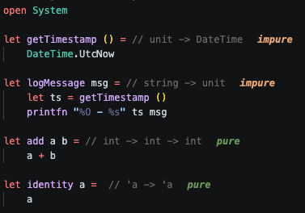

# fspure
A code analyser and vscode plugin, which helps you spot impure functions.



## known pure functions

This works by assembling a list of known "pure" functions. As long as your functions only use known pure constructs/functions, your function is marked as pure. Otherwise, it is marked as impure.

Currently, the following core libraries are scanned and included:

````
    "System.Private.CoreLib"
    "System.Runtime"
    "System.Console"
    "System.Linq"
    "System.Collections"
    "System.Collections.Concurrent"
    "System.Collections.Immutable"
    "System.Memory"
    "System.Threading"
    "System.Threading.Tasks"
    "System.Text.RegularExpressions"
    "System.ObjectModel"
    "System.Numerics"
    "FSharp.Core"

    "System.Text.Json"                    // JsonSerializer, JsonNode, Utf8JsonReader (pure parts)
    "System.Text.Encodings.Web"           // HtmlEncoder, UrlEncoder
    "System.Xml.Linq"                     // XElement / XDocument construction
    "System.Xml.XDocument"                // (some runtimes ship this separately)
    "System.Xml"                          // core XML
    "System.Globalization"               // CultureInfo pure helpers, formatting
    "System.Buffers"                      // ArrayPool is impure, many helpers pure
    "System.IO.Pipelines"                 // PipeReader/Writer pure helpers (careful)
    "System.Runtime.CompilerServices.Unsafe"
    "System.Runtime.InteropServices"      // limited pure surface
    "Microsoft.Extensions.Primitives"     // StringValues, StringSegment
    "Microsoft.Extensions.DependencyInjection.Abstractions" // rarely pure, but small
    "System.ComponentModel"               // TypeConverter pure bits
    "System.ComponentModel.Primitives"
    "System.ComponentModel.TypeConverter"
    "System.Diagnostics.DiagnosticSource" // Activity is impure, some helpers pure
    "System.Net.Http.Json"                // JsonContent pure helpers
    "System.Text.Json.Serialization" 
```