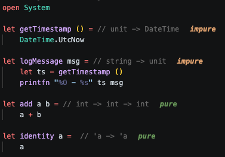

<p align="center">
  
</p>

> Typically, interactions with the outside world occur at the boundary of your application.  
> — Isaac Abraham

# fspure

This project explores how an **F# analyzer** and **VS Code extension** can help you push impurity to the boundary of your application.

It does that by defining a pure subset and marking everything else as impure.



| Component | Role |
|-----------|------|
| **FSharp.PureAnalyzer** | Classifies definitions (`PURE002` impure / `PURE003` pure) for Ionide & `fsharp-analyzers` |
| **fsharp-pure-decorations** | VS Code extension: end-of-line **pure** / **impure** badges after Ionide LineLens |

---

## Consume fspure (end users)

**Start here:** [customer.md](customer.md) — install without a dev container, or what to add to **your** `devcontainer.json`.

You need **both** pieces for the full IDE experience: the analyzer produces diagnostics; the extension turns them into badges.

### Easy path — Open VSX + nuget.org

#### 1. Analyzer (NuGet)

```bash
dotnet add package FSharp.PureAnalyzer
```

Paket:

```
nuget FSharp.PureAnalyzer
```

The package places the analyzer DLL under `analyzers/dotnet/fs/`.

#### 2. VS Code extension (Open VSX)

The extension is published to [Open VSX](https://open-vsx.org/) (not the Visual Studio Marketplace).

- **VSCodium / code-server / Cursor (Open VSX):** Extensions → search **F# Pure Analyzer Decorations** (`e-st.fsharp-pure-decorations`)
- **VS Code (Microsoft Marketplace by default):** install the VSIX from [GitHub Releases](https://github.com/e-St/fspure/releases), or point the client at Open VSX if you use that setup

Also install [Ionide for F#](https://open-vsx.org/extension/Ionide/Ionide-fsharp) (or the Marketplace build) if you do not already use it.

#### 3. Workspace settings

`.vscode/settings.json` (minimal):

```json
{
  "FSharp.enableAnalyzers": true,
  "FSharp.analyzersPath": [
    "analyzers",
    "packages/Analyzers"
  ],
  "FSharp.inlayHints.typeAnnotations": false,
  "FSharp.inlayHints.parameterNames": true,
  "FSharp.lineLens.enabled": "replaceCodeLens",
  "FSharp.lineLens.prefix": "// ",
  "fsharpPureDecorations.enabled": true,
  "workbench.colorCustomizations": {
    "editorHint.foreground": "#00000000",
    "editorHint.border": "#00000000",
    "editorOverviewRuler.hintForeground": "#00000000"
  }
}
```

`FSharp.analyzersPath` must resolve to a real directory for **FSAC** (Ionide’s language server). FSAC does **not** expand `${userHome}`, `~`, or other VS Code variables — use a workspace-relative folder (e.g. `analyzers`) or an absolute path. After `dotnet add package`, copy or symlink the package’s `analyzers/` tree into your workspace, or point the path at the absolute NuGet package version folder.

Open your solution / project, open an F# file, wait for Ionide to load. You should see LineLens signatures and pure/impure badges on definitions.

> **Note:** Open VSX and nuget.org publishes require maintainer secrets (`OVSX_PAT`, `NUGET_USER` for Trusted Publishing). Until those are configured, use the advanced GitHub path below — behavior is the same.

---

### Advanced path — GitHub Releases + GitHub Packages

Same runtime model as the easy path; you install artifacts from this repository instead of the official stores.

#### Analyzer from GitHub Packages

1. Create a `nuget.config` (or user-level source) that includes GitHub Packages for this org/user, and authenticate with a PAT that has `read:packages`.

```xml
<?xml version="1.0" encoding="utf-8"?>
<configuration>
  <packageSources>
    <add key="nuget.org" value="https://api.nuget.org/v3/index.json" />
    <add key="github-e-st" value="https://nuget.pkg.github.com/e-St/index.json" />
  </packageSources>
</configuration>
```

```bash
dotnet nuget add source \
  "https://nuget.pkg.github.com/e-St/index.json" \
  --name github-e-st \
  --username YOUR_GITHUB_USERNAME \
  --password YOUR_GITHUB_PAT \
  --store-password-in-clear-text

dotnet add package FSharp.PureAnalyzer --source github-e-st
```

Or download the `.nupkg` from a [GitHub Release](https://github.com/e-St/fspure/releases) and install from a local folder:

```bash
dotnet nuget add source /path/to/nupkgs --name local-fspure
dotnet add package FSharp.PureAnalyzer --source local-fspure
```

#### Extension from GitHub Release VSIX

1. Download `fsharp-pure-decorations-*.vsix` from [Releases](https://github.com/e-St/fspure/releases) (tag `vscode-extension-v*` or floating `vscode-extension-latest`).
2. Install:

```bash
code --install-extension fsharp-pure-decorations-0.2.5.vsix
```

#### Dev containers in this repository

| Container | Path | Use for |
|-----------|------|---------|
| **fspure IDE** (default) | [`.devcontainer/`](.devcontainer/) | Codespaces, local “Reopen in Container”, pure/impure labels while hacking |
| **PureAnalyzer build** | [`FSharp.PureAnalyzer/.devcontainer/`](FSharp.PureAnalyzer/.devcontainer/) | CI pack/build (`dotnet` / `paket` / `bundlef`) — no IDE setup |
| **e2e** | [`e2e/phase2/.devcontainer/`](e2e/phase2/.devcontainer/) | CI / local phase 1–2 only (code-server + Playwright) — not for daily work |

All three are **generated** from shared fragments under [`.devcontainer/fragments/`](.devcontainer/fragments/) (`python3 .devcontainer/generate.py`). Workflow [generate-devcontainers.yml](.github/workflows/generate-devcontainers.yml) regenerates and commits them when fragments change. Image base is `ghcr.io/e-st/fstarter`; e2e adds layers in its Dockerfile only. No Dev Container Features.

Details: [`.devcontainer/README.md`](.devcontainer/README.md) and [e2e/README.md](e2e/README.md).

**fspure IDE** (`postCreate` / `postAttach` → `setup-fspure-ide.sh`) installs:

1. **FSharp.PureAnalyzer** — nuget.org if published, else packs this repo; always drops the DLL under `analyzers/dotnet/fs/` for Ionide  
2. **fsharp-pure-decorations** — packages this repo’s VSIX (Open VSX as fallback)  

Pack/build and customer e2e use the other containers above, not this one.

While developing the analyzer against the local tree:

```bash
bash FSharp.PureAnalyzer/update-analyzer.sh   # → analyzers/dotnet/fs/ + NuGet global
bash vscode-extension/update-extension.sh    # optional: refresh decorations VSIX
# then: Developer: Reload Window
```

---

### Optional: CLI-only (no VS Code)

```bash
dotnet tool install --global fsharp-analyzers
fsharp-analyzers --project YourProject.fsproj \
  --analyzers-path path/to/analyzers-or-package-root
```

---

## Known pure functions

Classification uses a list of known pure methods. If a definition only uses pure constructs/functions, it is marked pure; otherwise impure.

Currently scanned / included core surfaces include:

```
System.Private.CoreLib
System.Runtime
System.Console
System.Linq
System.Collections
System.Collections.Concurrent
System.Collections.Immutable
System.Memory
System.Threading
System.Threading.Tasks
System.Text.RegularExpressions
System.ObjectModel
System.Numerics
FSharp.Core
System.Text.Json
System.Text.Encodings.Web
System.Xml.Linq
System.Xml
System.Globalization
System.Buffers
System.IO.Pipelines
System.Runtime.CompilerServices.Unsafe
System.Runtime.InteropServices
Microsoft.Extensions.Primitives
Microsoft.Extensions.DependencyInjection.Abstractions
System.ComponentModel
System.ComponentModel.Primitives
System.ComponentModel.TypeConverter
System.Diagnostics.DiagnosticSource
System.Net.Http.Json
System.Text.Json.Serialization
```

---

## How to make your library fspure-ready

One line on a **net10.0** library (use a `FSharp.PureAnalyzer` package that ships MSBuild embed targets):

```xml
<PackageReference Include="FSharp.PureAnalyzer" Version="VERSION" PrivateAssets="all" />
```

That embeds `{AssemblyName}.pure.json` into your DLL. Vanilla fspure consumers then get pure/impure labels for your API automatically.

- Template + badges table: [samples/fspure-ready-lib](samples/fspure-ready-lib/)
- Architecture (embed, discovery, precedence): [docs/ARCHITECTURE.md](docs/ARCHITECTURE.md)
- Monorepo proof (local NuGet feed, no publish required):

```bash
bash scripts/fspure-ready-lib-gate.sh
# or: bash e2e/ready-lib/run.sh
```

Publishing your library to nuget.org is optional; CI proves the path with a local feed.

### Override the pure list (no fork)

In your **app** project, add `fspure.overrides.json` next to the `.fsproj`:

```json
{
  "schemaVersion": "1.0",
  "useFoundational": true,
  "add": [ "MyCompany.Helpers.IPromiseThisIsPure" ],
  "remove": [ "Some.Method.I.Do.Not.Trust" ]
}
```

Precedence: **overrides > library embeds > foundational**.  
Disable the built-in foundational list: `"useFoundational": false` or env `FSPURE_DISABLE_FOUNDATIONAL=1`.

---

## Develop this repository

- **Interactive IDE:** open the repo in Codespaces or “Reopen in Container” → root [`.devcontainer/`](.devcontainer/) (“fspure IDE”)
- **CI pack/build:** [`FSharp.PureAnalyzer/.devcontainer/`](FSharp.PureAnalyzer/.devcontainer/) (not the IDE container)
- Solution: `fspure.slnx` (`FSharp.PureAnalyzer`, `fspure-collector`)
- Customer e2e (separate container): [e2e/README.md](e2e/README.md)
- Library-embed gate: [e2e/ready-lib/README.md](e2e/ready-lib/README.md) · workflow `fspure-ready-lib-gate.yml`
- fstarter integration pack + PR sync: [integrations/fstarter](integrations/fstarter/) · [docs/SYNC-FSTARTER.md](docs/SYNC-FSTARTER.md)
- Maintainer publishing (secrets, Open VSX, nuget.org): [docs/PUBLISHING.md](docs/PUBLISHING.md)
- Security (Dependabot, CodeQL, audits): [docs/SECURITY.md](docs/SECURITY.md)
- Releasing (Release PR, beta, pins): [docs/RELEASING.md](docs/RELEASING.md) · [releases/](releases/)
- Language policy (F# first): [docs/LANGUAGES.md](docs/LANGUAGES.md)

```bash
# Analyzer
cd FSharp.PureAnalyzer && paket restore && dotnet build -c Release

# Extension unit tests
node vscode-extension/test/decorations.logic.test.js

# Phase 1 e2e (analyzer baseline; in CI runs inside e2e/phase2/.devcontainer)
bash e2e/phase1/run.sh

# Phase 4 library-embed gate (local feed)
bash scripts/fspure-ready-lib-gate.sh

# Phase 5 permanent regression (foundational + ReadyLib PackageRef/ProjectRef + golden + fallbacks)
bash scripts/phase5-regression.sh
```

## License

MIT — see [LICENSE](LICENSE).
