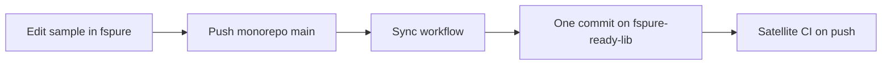

# Sync monorepo sample → `e-St/fspure-ready-lib`

The **source of truth** for the public sample library is:

```text
e-St/fspure   →   samples/fspure-ready-lib/
```

The standalone repo is:

```text
https://github.com/e-St/fspure-ready-lib
```

## How sync works

The workflow **Sync fspure-ready-lib**:

1. Copies `samples/fspure-ready-lib/` into a clone of the satellite (rsync; excludes `bin`/`obj`/`artifacts`).
2. Creates **one synthetic git commit** on the satellite (`sync from e-St/fspure@<sha>`).
3. **`git push`**es to `main`.

That push is a normal GitHub `push` event, so **workflows in the satellite** (CI, embed tests, publish, …) still run.



---

## One-time setup (required)

`GITHUB_TOKEN` from the fspure job **cannot** push to another repository.

### Fine-grained PAT

1. Create a fine-grained PAT with access **only** to **`fspure-ready-lib`**.
2. Under **Repository permissions**, set **both**:

   | Permission | Access | Why |
   |------------|--------|-----|
   | **Contents** | **Read and write** | Clone, commit, push normal files |
   | **Workflows** | **Read and write** | Required to create/update `.github/workflows/*.yml` |

   Without **Workflows**, GitHub rejects the push with:

   > refusing to allow a Personal Access Token to create or update workflow  
   > `...` without `workflow` scope

3. In **`e-St/fspure`** → **Settings → Secrets and variables → Actions**:
   - Name: **`FSPURE_READY_LIB_PUSH_TOKEN`**  
   - Value: the PAT  

If you already created a token with only Contents, either **edit** that fine-grained token and add **Workflows: Read and write**, or generate a new one and update the secret.

### Branch protection on the satellite

- Allow the PAT identity to push to `main`, or bypass for that account.
- Prefer editing only in the monorepo; satellite commits from humans can be overwritten on the next sync.

---

## Day-to-day

1. Edit **`samples/fspure-ready-lib/`** in **fspure**.
2. Merge/push to **`main`** on **fspure**.
3. **Sync fspure-ready-lib** runs.
4. **fspure-ready-lib** gets one synthetic commit on **`main`** (customer CI) and, by default, the same tip on **`dev`** (integration CI).

Manual: **Actions → Sync fspure-ready-lib → Run workflow** (optional dry_run / also_dev).

---

## Satellite CI (two channels)

| Branch | Workflow | Analyzer source |
|--------|----------|-----------------|
| `main` | `CI` | Released **nuget.org** |
| `dev` | `CI (dev)` | Latest **GitHub Packages** (`e-St`) |

Both are pushed by the monorepo sync so the **same sample tree** is tested against released tools (customer story) and unreleased monorepo builds (dev).

---

## Failure modes

| Symptom | Fix |
|---------|-----|
| Secret not set | Add `FSPURE_READY_LIB_PUSH_TOKEN` on **fspure** |
| `403` on push | PAT needs **Contents: Write** on **fspure-ready-lib** |
| Fork runs sync | Blocked by `if: github.repository == 'e-St/fspure'` |

---

## Security

- Scope the token to **one** repo (`fspure-ready-lib`).
- Store it only as a secret on **fspure**.
