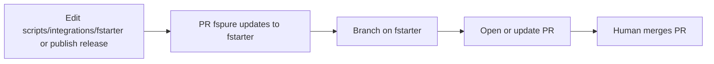

# Sync fspure integration pack → `e-St/fstarter` (pull request)

The **source of truth** for how fstarter enables fspure is:

```text
e-St/fspure  →  scripts/integrations/fstarter/
```

Target:

```text
https://github.com/e-St/fstarter
```

Unlike `fspure-ready-lib` (force-push satellite), **fstarter** receives a **pull request** so template maintainers can review devcontainer and version pin changes.



## What gets updated

| Path in fstarter | Source |
|------------------|--------|
| `.devcontainer/setup-fspure.sh` | `scripts/integrations/fstarter/overlay/.devcontainer/setup-fspure.sh` |
| `.devcontainer/devcontainer.json` | overlay (fspure Ionide / decorations settings) |
| `.devcontainer/fspure-versions.env` | generated pin (`FSPURE_ANALYZER_VERSION=…`) |
| `Directory.Build.props` | strict compiler rules (FS0025, TreatWarningsAsErrors, Nullable) |
| `.fspure-sync-source` | sync metadata |
| `.gitignore` | ensures `**/analyzers/` is ignored |

**Not overwritten:** `Dockerfile`, `newf.sh`, `bundlef.sh`, and other fstarter-owned scripts.

## Version pin

`FSPURE_ANALYZER_VERSION` is written to `.devcontainer/fspure-versions.env` and read by `setup-fspure.sh`, which installs that exact package from nuget.org.

Priority when resolving the pin:

1. Workflow input `analyzer_version` (manual dispatch)
2. GitHub Release tag (e.g. `v0.4.0` → `0.4.0`)
3. `scripts/integrations/fstarter/versions.env` in fspure
4. Latest stable version on nuget.org

## One-time setup

`GITHUB_TOKEN` from fspure **cannot** open PRs on another repository.

### Fine-grained PAT

1. Create a fine-grained PAT with access **only** to **`e-St/fstarter`**.
2. Repository permissions:

   | Permission | Access |
   |------------|--------|
   | **Contents** | Read and write |
   | **Pull requests** | Read and write |

3. In **`e-St/fspure`** → **Settings → Secrets and variables → Actions**:
   - Name: **`FSPURE_FSTARTER_TOKEN`**
   - Value: the PAT

## When the workflow runs

| Trigger | Workflow |
|---------|----------|
| Push to `main` changing `scripts/integrations/fstarter/**` | **PR fspure updates to fstarter** |
| GitHub Release published | same (pins from release tag when possible) |
| Manual **Actions → PR fspure updates to fstarter** | same (`analyzer_version`, `dry_run`) |

## Day-to-day

1. Edit **`scripts/integrations/fstarter/`** in fspure (overlay scripts/settings, `versions.env`).
2. Merge to **main** (or publish a release / run the workflow manually with a version).
3. Workflow opens (or updates) a PR on **fstarter**.
4. Review and merge the PR on fstarter.

Local dry-run:

```bash
git clone https://github.com/e-St/fstarter.git /tmp/fstarter
bash scripts/prepare-fstarter-update.sh /tmp/fstarter 0.4.0
cd /tmp/fstarter && git status && git diff
```

## Relation to nuget.org publish

After **Publish Pure Analyzer to nuget.org** ships a new `FSharp.PureAnalyzer` version:

1. Bump `scripts/integrations/fstarter/versions.env` (or pass `analyzer_version` on dispatch).
2. Run **PR fspure updates to fstarter** (or push the versions.env change to main).

Optional: chain from release only — the release event already triggers this workflow.
