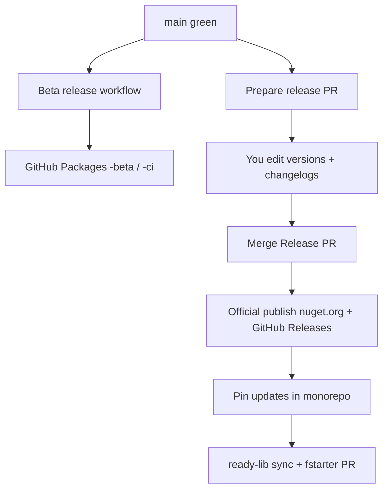

# Releasing fspure

Modern release flow: **beta anytime**, **official only via an editable Release PR**.



## Components

| Id | Artifact | Changelog |
|----|----------|-----------|
| `FSharp.PureAnalyzer` | NuGet analyzer + embed tools | `src/docs/releases/CHANGELOG.FSharp.PureAnalyzer.md` |
| `fspure-collector` | NuGet dotnet tool | `src/docs/releases/CHANGELOG.fspure-collector.md` |
| `fsharp-pure-decorations` | Open VSX / VSIX | `src/docs/releases/CHANGELOG.fsharp-pure-decorations.md` |
| `fspure-reduce-impurity` | Copilot / Claude skill (`gh skill --pin`) | `src/docs/releases/CHANGELOG.fspure-reduce-impurity.md` |

Last published official versions: **`src/docs/releases/manifest.json`** → `lastOfficial`.

---

## Beta / “commit” releases (often)

**Actions → Beta release (GitHub Packages) → Run workflow**

- Packs analyzer + collector as `{lastOfficial}-beta.{run}.{sha}` (or `-ci.`)
- Pushes **only** to **GitHub Packages**
- Does **not** change nuget.org, official tags, or README pins

Also can fire after **Phase 5 Regression** succeeds on `main` (workflow_run).

---

## Official release (controlled)

### 1. Prepare Release PR

**Actions → Prepare release PR → Run workflow**

Optional inputs: exact next versions and which components to publish.

A push to `main` that changes `plugins/fspure/skills/**` (or the skill README) opens a **skill-only** Release PR (`release/fspure-reduce-impurity`) so you can set the skill `to` version and changelog without publishing nuget packages.

Creates a PR that updates:

- `src/docs/releases/manifest.json` → `pending` (versions + `publish` flags)
- Each changelog’s **`## [Unreleased]`** draft (from git log — rewrite freely)

### 2. Edit the PR

1. Open `src/docs/releases/manifest.json`
2. Set each component’s **`to`** version (e.g. `0.5.0`)
3. Set **`publish`: true/false** per component
4. Edit each **CHANGELOG.*** Unreleased section until you like the notes

### 3. Merge the PR

Triggers **Official release**:

1. OIDC login to nuget.org when analyzer/collector are selected (`NUGET_USER` — **see note below**)
2. Pack + publish selected packages (skipped for a skill-only release)
3. GitHub Release assets (`v{version}` for the analyzer; `fspure-reduce-impurity-v{version}` for the skill)
4. Promote `pending` → `lastOfficial`, clear `pending`
5. **apply-version-pins**: fsproj / package.json / sample / fstarter `versions.env` / READMEs  
   (`FSPURE_SKILL_REF` becomes `fspure-reduce-impurity-v{skill}` when that component is published)
6. Commit pin updates to `main`
7. `sync-readme`: regenerate root `README.md` and `src/docs/EXAMPLES.md` from `src/docs/human/` + templates, commit if needed
8. Publish **fspure.net** from `.generated/site`
9. Dispatch **Sync fspure-ready-lib** + **PR fspure updates to fstarter**

### Trusted Publishing (required once)

NuGet OIDC binds to the **workflow file name**. Register on nuget.org → Trusted Publishing:

| Field | Value |
|-------|--------|
| Repository | `e-St/fspure` |
| Workflow file | **`official-release.yml`** |
| Environment | _(empty)_ |

You may keep the existing policy for `nuget_publish.yml` as a manual fallback.

---

## Pin locations updated after official release

| Location | Field |
|----------|--------|
| `src/FSharp.PureAnalyzer/*.fsproj` | `<Version>` |
| `src/fspure-collector/*.fsproj` | `<Version>` |
| `src/editor/vscode-extension/package.json` | `version` |
| `src/samples/fspure-ready-lib/Directory.Packages.props` | `FspureAnalyzerVersion` |
| `src/samples/fspure-ready-lib/src/scripts/resolve-fspure-analyzer-version.sh` | fallback |
| `src/scripts/integrations/fstarter/versions.env` | `FSPURE_ANALYZER_VERSION`, `FSPURE_SKILL_REF=fspure-reduce-impurity-v{skill}` |
| `plugins/fspure/.claude-plugin/plugin.json` | skill / marketplace plugin version |
| Sample / root README examples | version strings |

ready-lib satellite is refreshed by **Sync fspure-ready-lib** (push).  
fstarter gets a **PR** via **PR fspure updates to fstarter**.

---

## Local dry-runs

```bash
# Draft pending + changelogs (no push)
bash src/scripts/release/prepare-release-pr.sh

# Apply pins from lastOfficial only
bash src/scripts/release/apply-version-pins.sh

# Beta to GH Packages (needs GITHUB_TOKEN)
GITHUB_TOKEN=… bash src/scripts/release/publish-beta.sh
```

---

## Secrets

| Secret | Used by |
|--------|---------|
| `NUGET_USER` | Official nuget.org OIDC |
| `OVSX_PAT` | Extension Open VSX (if publishing extension) |
| `FSPURE_READY_LIB_PUSH_TOKEN` | ready-lib sync |
| `FSPURE_FSTARTER_TOKEN` | fstarter PR |
| `FSPURE_RELEASE_PR_TOKEN` | Prepare release PR (optional). Fine-grained PAT on **e-St/fspure**: Contents + Pull requests read/write. Needed when the default `GITHUB_TOKEN` is not allowed to create PRs. |

If **Prepare release PR** fails with `GitHub Actions is not permitted to create or approve pull requests`, either:

1. Repo (or org) **Settings → Actions → General → Workflow permissions → Allow GitHub Actions to create and approve pull requests**, or
2. Add secret **`FSPURE_RELEASE_PR_TOKEN`**.
